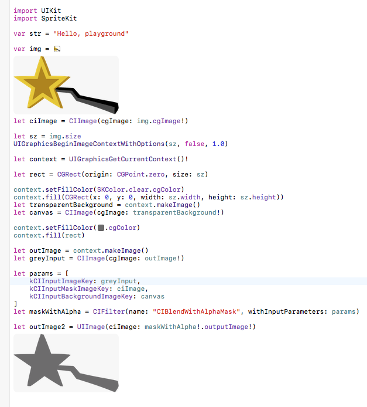

# Playgrounds for CoreGraphics Recipes

Turns out you can use Playgrounds to really effectively to zero in on
CoreGraphics recipes that work on both Mac & iOS.  I'll try to keep
this updated with new recipes I figure out.

## Shadow

This one creates a flat coloured shadow from an image so that you can
create a button face with a shape from a UIImage or NSImage and then
create a shadow to go under it.

Note: the images are Copyright (c) 2016 Smithsoft

Everything else is MIT Licensed.  See the file LICENSE for details.
